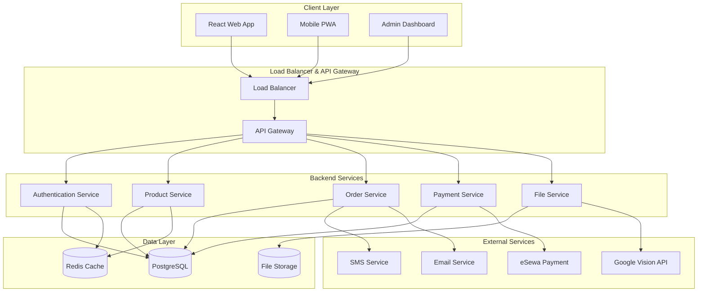

# MediNest E-Pharmacy System Design

## 🏗️ System Architecture Overview

### High-Level Architecture

## 🎯 Core System Components

### 1. Frontend Architecture

- **Framework**: React 18 with Vite
- **State Management**: React Context + useReducer
- **Styling**: Bootstrap 5 + Custom CSS
- **Routing**: React Router v6
- **API Client**: Axios with interceptors

### 2. Backend Architecture

- **Framework**: Django 4.2 + Django REST Framework
- **Database**: PostgreSQL 15
- **Cache**: Redis 7
- **Authentication**: JWT with refresh tokens
- **File Storage**: Local file system with cloud-ready structure
- **Payment**: eSewa integration

### 3. Database Design

- **Primary Database**: PostgreSQL
- **Caching Layer**: Redis for session management and frequent queries
- **File Storage**: Local file system for images and documents

## 🔄 System Flow

### User Authentication Flow

1. User registers/logs in via React frontend
2. Django backend validates credentials
3. JWT tokens generated and stored in httpOnly cookies
4. Frontend stores user context in React Context
5. Protected routes check authentication status

### Order Processing Flow

1. User browses products and adds to cart
2. Cart data stored in Redis for performance
3. Checkout process creates Order in PostgreSQL
4. Payment processed through eSewa integration
5. Order status updated and user notified
6. Inventory adjusted automatically

### Prescription Management Flow

1. User uploads prescription file
2. File stored in designated directory
3. Optional OCR processing via Google Vision API
4. Prescription linked to order for verification
5. Admin panel for prescription approval workflow

## 🚀 Scalability Considerations

### Current Architecture (Monolithic)

- Single Django application
- Single PostgreSQL database
- Single Redis instance
- Suitable for medium-scale deployment

### Future Scaling Strategy

- **Horizontal Scaling**: Multiple Django instances behind load balancer
- **Database Scaling**: Read replicas and connection pooling
- **Caching**: Redis cluster for high availability
- **CDN**: Static assets served via CDN
- **Microservices**: Split into independent services when needed

## 🔒 Security Architecture

### Authentication & Authorization

- JWT tokens with short expiration (15 min) and refresh tokens
- Role-based access control (User, Admin)
- CSRF protection enabled
- Rate limiting on sensitive endpoints

### Data Security

- Password hashing with PBKDF2
- Sensitive data encryption at rest
- File upload validation and sanitization
- SQL injection prevention via ORM

### API Security

- CORS configuration for frontend domain
- API rate limiting
- Input validation and sanitization
- Error handling without information leakage

## 📊 Performance Optimizations

### Caching Strategy

- Redis for user sessions and cart data
- Database query result caching
- Static asset caching
- API response caching for public data

### Database Optimizations

- Proper indexing on frequently queried fields
- Connection pooling
- Query optimization and N+1 prevention
- Database read replicas for reporting

### Frontend Optimizations

- Code splitting and lazy loading
- Image optimization and lazy loading
- Bundle size optimization
- Service worker for offline capability
