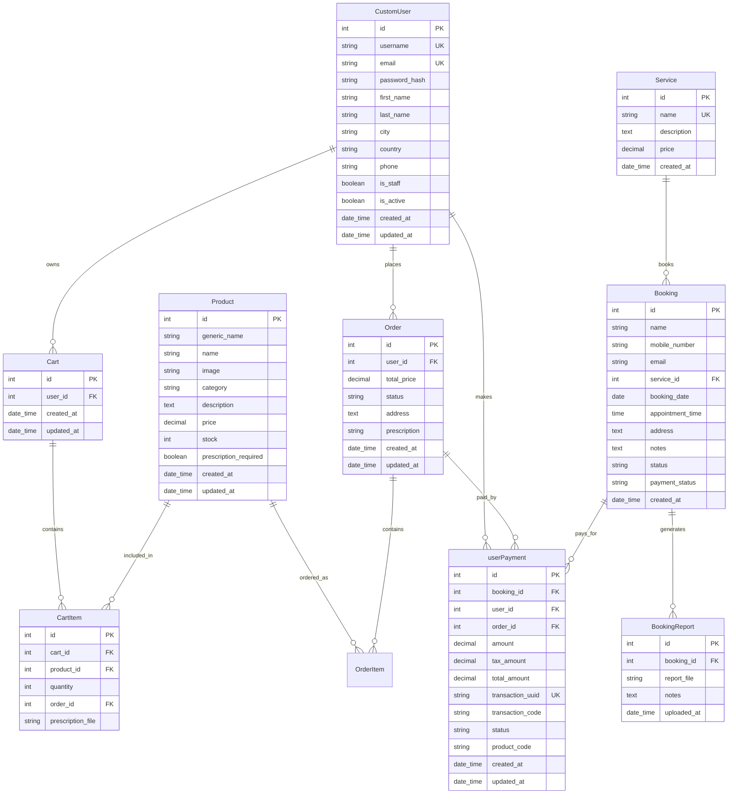

# MediNest Database Schema Design

## 🗄️ Entity Relationship Diagram



## 📋 Database Tables Overview

### Core Tables

#### 1. CustomUser
**Purpose**: Extended user model with pharmacy-specific fields
```sql
CREATE TABLE CustomUser (
    id SERIAL PRIMARY KEY,
    username VARCHAR(150) UNIQUE NOT NULL,
    email VARCHAR(150) UNIQUE NOT NULL,
    password_hash VARCHAR(128) NOT NULL,
    first_name VARCHAR(150),
    last_name VARCHAR(150),
    city VARCHAR(50),
    country VARCHAR(50),
    phone VARCHAR(50),
    is_staff BOOLEAN DEFAULT FALSE,
    is_active BOOLEAN DEFAULT TRUE,
    is_superuser BOOLEAN DEFAULT FALSE,
    created_at TIMESTAMP DEFAULT CURRENT_TIMESTAMP,
    updated_at TIMESTAMP DEFAULT CURRENT_TIMESTAMP
);
```

#### 2. Product
**Purpose**: Medicine and health product catalog
```sql
CREATE TABLE Product (
    id SERIAL PRIMARY KEY,
    generic_name VARCHAR(200),
    name VARCHAR(200),
    image VARCHAR(255),
    category VARCHAR(50) CHECK (category IN (
        'OTC', 'RX', 'SUP', 'WOM', 'MEN', 'PED', 'HERB', 'DIAG', 'FIRST'
    )),
    description TEXT,
    price DECIMAL(10,2) DEFAULT 0,
    stock INTEGER DEFAULT 0,
    prescription_required BOOLEAN DEFAULT FALSE,
    created_at TIMESTAMP DEFAULT CURRENT_TIMESTAMP,
    updated_at TIMESTAMP DEFAULT CURRENT_TIMESTAMP
);
```

#### 3. Cart
**Purpose**: User shopping cart management
```sql
CREATE TABLE Cart (
    id SERIAL PRIMARY KEY,
    user_id INTEGER REFERENCES CustomUser(id),
    created_at TIMESTAMP DEFAULT CURRENT_TIMESTAMP,
    updated_at TIMESTAMP DEFAULT CURRENT_TIMESTAMP
);
```

#### 4. CartItem
**Purpose**: Individual items in user cart
```sql
CREATE TABLE CartItem (
    id SERIAL PRIMARY KEY,
    cart_id INTEGER REFERENCES Cart(id),
    product_id INTEGER REFERENCES Product(id),
    quantity INTEGER DEFAULT 1,
    order_id INTEGER REFERENCES Order(id),
    prescription_file VARCHAR(255)
);
```

#### 5. Order
**Purpose**: Customer order records
```sql
CREATE TABLE Order (
    id SERIAL PRIMARY KEY,
    user_id INTEGER REFERENCES CustomUser(id),
    total_price DECIMAL(10,2),
    status VARCHAR(50) CHECK (status IN ('pending', 'shipped', 'delivered')),
    address TEXT NOT NULL,
    prescription VARCHAR(255),
    created_at TIMESTAMP DEFAULT CURRENT_TIMESTAMP,
    updated_at TIMESTAMP DEFAULT CURRENT_TIMESTAMP
);
```

#### 6. userPayment
**Purpose**: Payment transaction records
```sql
CREATE TABLE userPayment (
    id SERIAL PRIMARY KEY,
    booking_id INTEGER REFERENCES Booking(id),
    user_id INTEGER REFERENCES CustomUser(id),
    order_id INTEGER REFERENCES Order(id),
    amount DECIMAL(10,2),
    tax_amount DECIMAL(10,2) DEFAULT 0,
    total_amount DECIMAL(10,2),
    transaction_uuid VARCHAR(100) UNIQUE,
    transaction_code VARCHAR(100),
    status VARCHAR(20) DEFAULT 'PENDING',
    product_code VARCHAR(50) DEFAULT 'EPAYTEST',
    created_at TIMESTAMP DEFAULT CURRENT_TIMESTAMP,
    updated_at TIMESTAMP DEFAULT CURRENT_TIMESTAMP
);
```

### Lab Booking Tables (Legacy - to be removed)

#### 7. Service
**Purpose**: Medical services offered (to be deprecated)
```sql
CREATE TABLE Service (
    id SERIAL PRIMARY KEY,
    name VARCHAR(100) UNIQUE NOT NULL,
    description TEXT,
    price DECIMAL(10,2),
    created_at TIMESTAMP DEFAULT CURRENT_TIMESTAMP
);
```

#### 8. Booking
**Purpose**: Lab test/service bookings (to be deprecated)
```sql
CREATE TABLE Booking (
    id SERIAL PRIMARY KEY,
    name VARCHAR(100) NOT NULL,
    mobile_number VARCHAR(15),
    email VARCHAR(255),
    service_id INTEGER REFERENCES Service(id),
    booking_date DATE,
    appointment_time TIME,
    address TEXT,
    notes TEXT,
    status VARCHAR(20) DEFAULT 'pending',
    payment_status VARCHAR(20) DEFAULT 'pending',
    created_at TIMESTAMP DEFAULT CURRENT_TIMESTAMP
);
```

#### 9. BookingReport
**Purpose**: Lab test reports (to be deprecated)
```sql
CREATE TABLE BookingReport (
    id SERIAL PRIMARY KEY,
    booking_id INTEGER REFERENCES Booking(id),
    report_file VARCHAR(255),
    notes TEXT,
    uploaded_at TIMESTAMP DEFAULT CURRENT_TIMESTAMP
);
```

## 🔍 Database Indexes

### Performance Critical Indexes
```sql
-- User authentication
CREATE INDEX idx_customuser_username ON CustomUser(username);
CREATE INDEX idx_customuser_email ON CustomUser(email);

-- Product catalog
CREATE INDEX idx_product_category ON Product(category);
CREATE INDEX idx_product_name ON Product(name);
CREATE INDEX idx_product_prescription ON Product(prescription_required);
CREATE INDEX idx_product_stock ON Product(stock);

-- Cart optimization
CREATE INDEX idx_cartitem_cart ON CartItem(cart_id);
CREATE INDEX idx_cartitem_product ON CartItem(product_id);

-- Order management
CREATE INDEX idx_order_user ON Order(user_id);
CREATE INDEX idx_order_status ON Order(status);
CREATE INDEX idx_order_created ON Order(created_at);

-- Payment tracking
CREATE INDEX idx_payment_user ON userPayment(user_id);
CREATE INDEX idx_payment_order ON userPayment(order_id);
CREATE INDEX idx_payment_transaction ON userPayment(transaction_uuid);
CREATE INDEX idx_payment_status ON userPayment(status);

-- Legacy tables (to be removed)
CREATE INDEX idx_booking_service ON Booking(service_id);
CREATE INDEX idx_booking_date ON Booking(booking_date);
```

## 🔄 Data Relationships

### Core Business Flow
1. **User Registration** → CustomUser record created
2. **Product Browsing** → Product catalog accessed
3. **Add to Cart** → Cart + CartItem records created
4. **Checkout** → Order created, CartItems linked to Order
5. **Payment** → userPayment record created with eSewa integration
6. **Order Fulfillment** → Order status updated, inventory adjusted

### Data Integrity Constraints
- Foreign key constraints ensure referential integrity
- Check constraints validate enum values
- Unique constraints prevent duplicate records
- NOT NULL constraints enforce required fields

## 📊 Data Migration Strategy

### Phase 1: Cleanup (Current Priority)
1. Remove Service, Booking, and BookingReport tables
2. Clean up userPayment to focus on e-commerce only
3. Optimize Product model for pharmacy use case

### Phase 2: Enhancement
1. Add prescription management tables
2. Implement audit logging tables
3. Add user preference and history tables

### Phase 3: Advanced Features
1. Inventory tracking tables
2. Supplier management tables
3. Analytics and reporting tables
