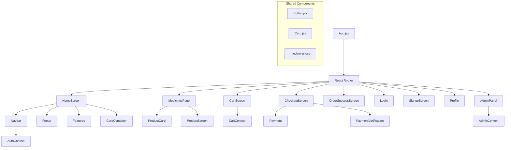

# MediNest Frontend Architecture

## 🎨 React Component Architecture

### Component Hierarchy



## 📱 Page Components

### Core Pages

#### 1. HomeScreen.jsx

```jsx
// Purpose: Landing page with featured products and hero section
// Features:
- Hero banner with call-to-action
- Featured products carousel
- Health categories grid
- Benefits/features section
- Newsletter signup

// State Management:
- useState for featured products
- useEffect for API data fetching
- Context for user authentication
```

#### 2. MedicinesPage.jsx

```jsx
// Purpose: Product catalog with search and filtering
// Features:
- Product grid with pagination
- Search functionality
- Category filtering
- Price range filtering
- Prescription required filter
- Sort options

// State Management:
- useState for filters and search
- useEffect for API calls
- Local state for pagination
```

#### 3. CartScreen.jsx

```jsx
// Purpose: Shopping cart management
// Features:
- Cart items display
- Quantity adjustment
- Remove items
- Total calculation
- Prescription upload
- Checkout button

// State Management:
- CartContext for global cart state
- Local state for UI interactions
```

#### 4. CheckoutScreen.jsx

```jsx
// Purpose: Order placement and address management
// Features:
- Address form
- Order summary
- Payment method selection
- Prescription file upload
- Order confirmation

// State Management:
- Form state for address
- CartContext for order data
- Local state for validation
```

#### 5. AdminPanel.jsx

```jsx
// Purpose: Administrative dashboard
// Features:
- Product management
- Order management
- User management
- Analytics dashboard
- Inventory tracking

// State Management:
- AdminContext for permissions
- Local state for CRUD operations
```

## 🔧 Context Providers

### 1. AuthContext.jsx

```jsx
// Purpose: Authentication state management
// Features:
- User login/logout
- Token management
- User profile data
- Authentication status

// Methods:
- login(username, password)
- logout()
- register(userData)
- refreshToken()
- checkAuthStatus()
```

### 2. CartContext.jsx

```jsx
// Purpose: Shopping cart state management
// Features:
- Add/remove items
- Quantity management
- Total calculation
- Cart persistence

// Methods:
- addToCart(product, quantity)
- removeFromCart(productId)
- updateQuantity(productId, action)
- clearCart()
- getCartTotal()
```

### 3. AdminContext.jsx

```jsx
// Purpose: Admin functionality management
// Features:
- Admin verification
- Permission checks
- Admin operations

// Methods:
- verifyAdmin()
- hasPermission(operation)
- refreshAdminStatus()
```

## 🎨 Styling Architecture

### CSS Structure

```
src/
├── index.css              # Global styles
├── bootstrap.min.css      # Bootstrap framework
├── components/
│   └── ui/
│       ├── modern-ui.css  # Custom UI components
│       ├── button.jsx     # Styled button component
│       └── card.jsx       # Card component
└── screens/
    └── LandingContainer.css # Screen-specific styles
```

### Styling Approach

1. **Bootstrap 5**: Base framework for responsive design
2. **Custom CSS**: Component-specific styling
3. **CSS Variables**: Theme consistency
4. **Mobile-First**: Responsive design principles

### Color Scheme

```css
:root {
  --primary-color: #2563eb; /* Blue */
  --secondary-color: #10b981; /* Green */
  --accent-color: #f59e0b; /* Amber */
  --danger-color: #ef4444; /* Red */
  --warning-color: #f59e0b; /* Orange */
  --success-color: #10b981; /* Green */
  --text-color: #1f2937; /* Dark gray */
  --bg-color: #ffffff; /* White */
  --border-color: #e5e7eb; /* Light gray */
}
```

## 🔄 State Management

### Global State (Context)

- **AuthContext**: User authentication and profile
- **CartContext**: Shopping cart functionality
- **DarkModeContext**: Theme switching

### Local State (useState)

- Component-specific UI state
- Form data
- Modal states
- Loading states

### Server State (React Query)

- Product data
- Order history
- User profile
- Search results

## 🛠️ Utility Functions

### API Client (api.js)

```javascript
// Centralized API configuration
const API_BASE_URL = "http://localhost:8000/api/v1";

// Axios instance with interceptors
const apiClient = axios.create({
  baseURL: API_BASE_URL,
  timeout: 10000,
});

// Request interceptor for auth tokens
apiClient.interceptors.request.use(
  (config) => {
    const token = localStorage.getItem("accessToken");
    if (token) {
      config.headers.Authorization = `Bearer ${token}`;
    }
    return config;
  },
  (error) => Promise.reject(error)
);

// Response interceptor for token refresh
apiClient.interceptors.response.use(
  (response) => response,
  async (error) => {
    if (error.response?.status === 401) {
      // Handle token refresh
      const refreshToken = localStorage.getItem("refreshToken");
      if (refreshToken) {
        try {
          const response = await axios.post(`${API_BASE_URL}/auth/refresh`, {
            refresh: refreshToken,
          });
          const { access } = response.data;
          localStorage.setItem("accessToken", access);

          // Retry original request
          error.config.headers.Authorization = `Bearer ${access}`;
          return axios(error.config);
        } catch (refreshError) {
          // Refresh failed, redirect to login
          localStorage.removeItem("accessToken");
          localStorage.removeItem("refreshToken");
          window.location.href = "/login";
        }
      }
    }
    return Promise.reject(error);
  }
);
```

## 📱 Responsive Design

### Breakpoints

```css
/* Mobile First Approach */
@media (min-width: 576px) {
  /* Small devices */
}
@media (min-width: 768px) {
  /* Medium devices */
}
@media (min-width: 992px) {
  /* Large devices */
}
@media (min-width: 1200px) {
  /* Extra large devices */
}
```

### Component Responsiveness

- **Grid Systems**: Bootstrap grid for layouts
- **Flexible Images**: max-width: 100%, height: auto
- **Responsive Typography**: rem units for scalability
- **Touch-Friendly**: Minimum 44px touch targets

## 🔐 Security Implementation

### Client-Side Security

- **XSS Prevention**: Input sanitization
- **CSRF Protection**: Django CSRF tokens
- **Secure Storage**: httpOnly cookies for tokens
- **Input Validation**: Client and server-side validation

### Authentication Flow

1. User submits credentials
2. Server validates and returns JWT tokens
3. Tokens stored in httpOnly cookies
4. Frontend stores user context
5. API calls include authentication headers

## 🚀 Performance Optimizations

### Code Splitting

```javascript
// Lazy loading for route components
const MedicinesPage = lazy(() => import("./components/screens/MedicinesPage"));
const CartScreen = lazy(() => import("./components/screens/CartScreen"));
const AdminPanel = lazy(() => import("./components/screens/AdminPanel"));
```

### Image Optimization

- **Lazy Loading**: Intersection Observer API
- **WebP Format**: Modern image formats
- **Responsive Images**: Different sizes for different screens
- **CDN**: Static asset delivery

### Bundle Optimization

- **Tree Shaking**: Remove unused code
- **Code Splitting**: Load components on demand
- **Minification**: Compress JavaScript and CSS
- **Compression**: Gzip/Brotli compression

## 🧪 Testing Strategy

### Unit Testing

- **Jest**: Test framework
- **React Testing Library**: Component testing
- **Coverage**: Minimum 80% code coverage

### Integration Testing

- **API Testing**: Mock API responses
- **User Flow Testing**: End-to-end scenarios
- **Cross-Browser Testing**: Multiple browser compatibility

### Performance Testing

- **Lighthouse**: Performance audits
- **Bundle Analysis**: Webpack bundle analyzer
- **Load Testing**: API endpoint testing

## 📱 PWA Features

### Service Worker

```javascript
// Service worker for offline functionality
self.addEventListener("install", (event) => {
  event.waitUntil(
    caches.open("medinest-v1").then((cache) => {
      return cache.addAll([
        "/",
        "/static/css/main.css",
        "/static/js/main.js",
        "/static/images/logo.png",
      ]);
    })
  );
});
```

### Web App Manifest

```json
{
  "name": "MediNest E-Pharmacy",
  "short_name": "MediNest",
  "description": "Online pharmacy for Nepal",
  "start_url": "/",
  "display": "standalone",
  "theme_color": "#2563eb",
  "background_color": "#ffffff",
  "icons": [
    {
      "src": "/icons/icon-192x192.png",
      "sizes": "192x192",
      "type": "image/png"
    }
  ]
}
```
