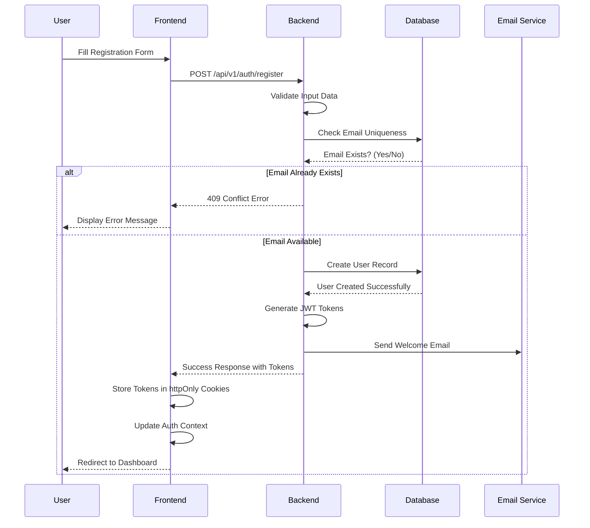
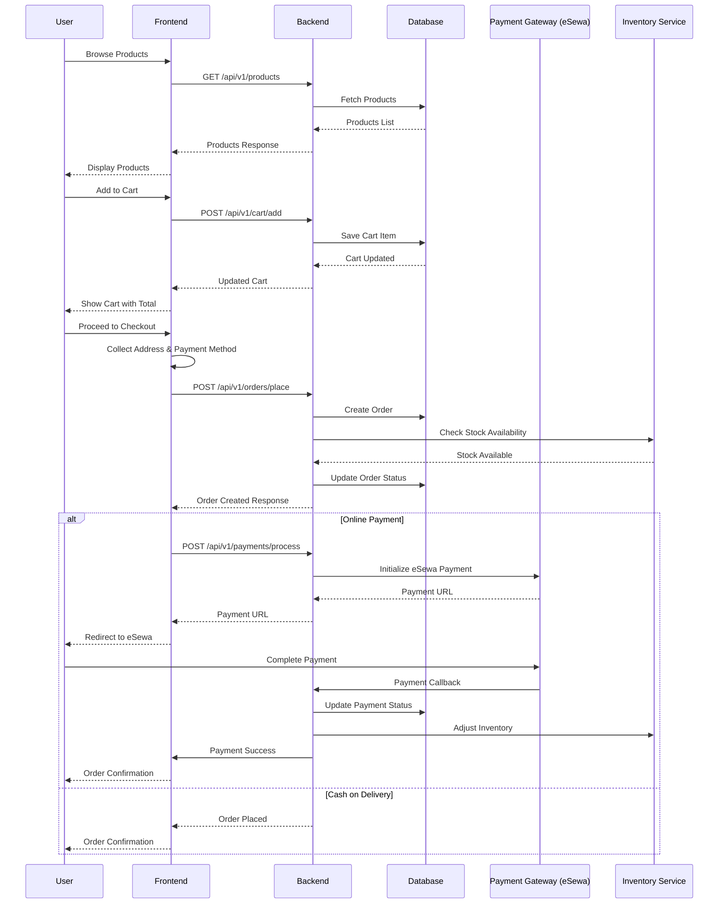
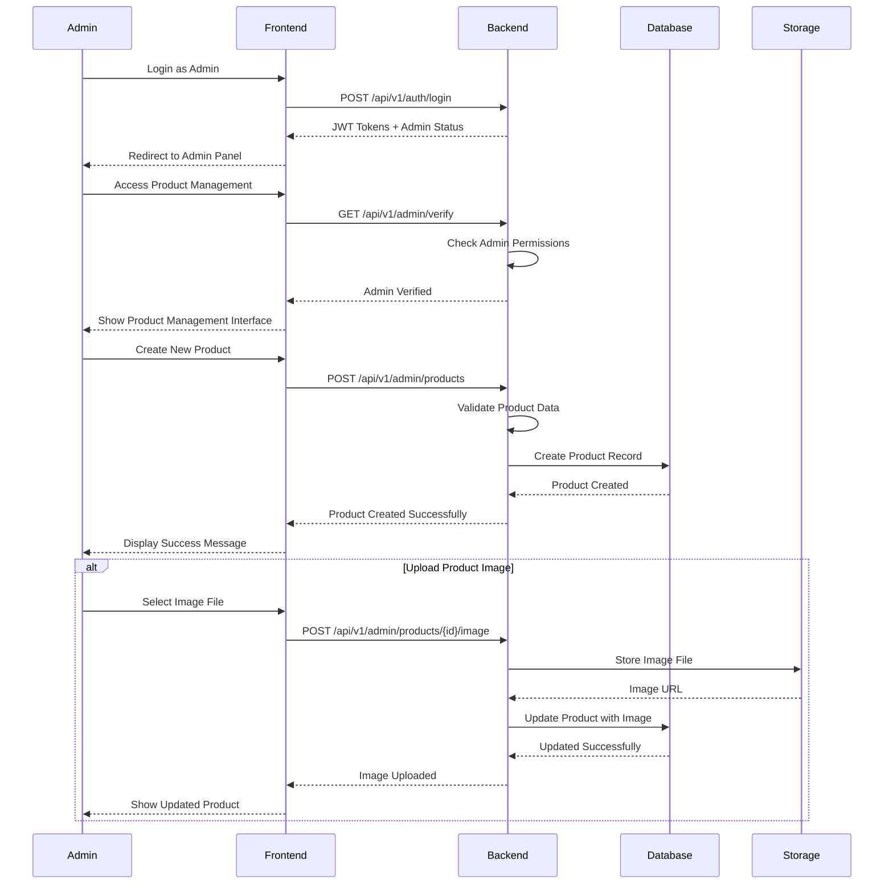
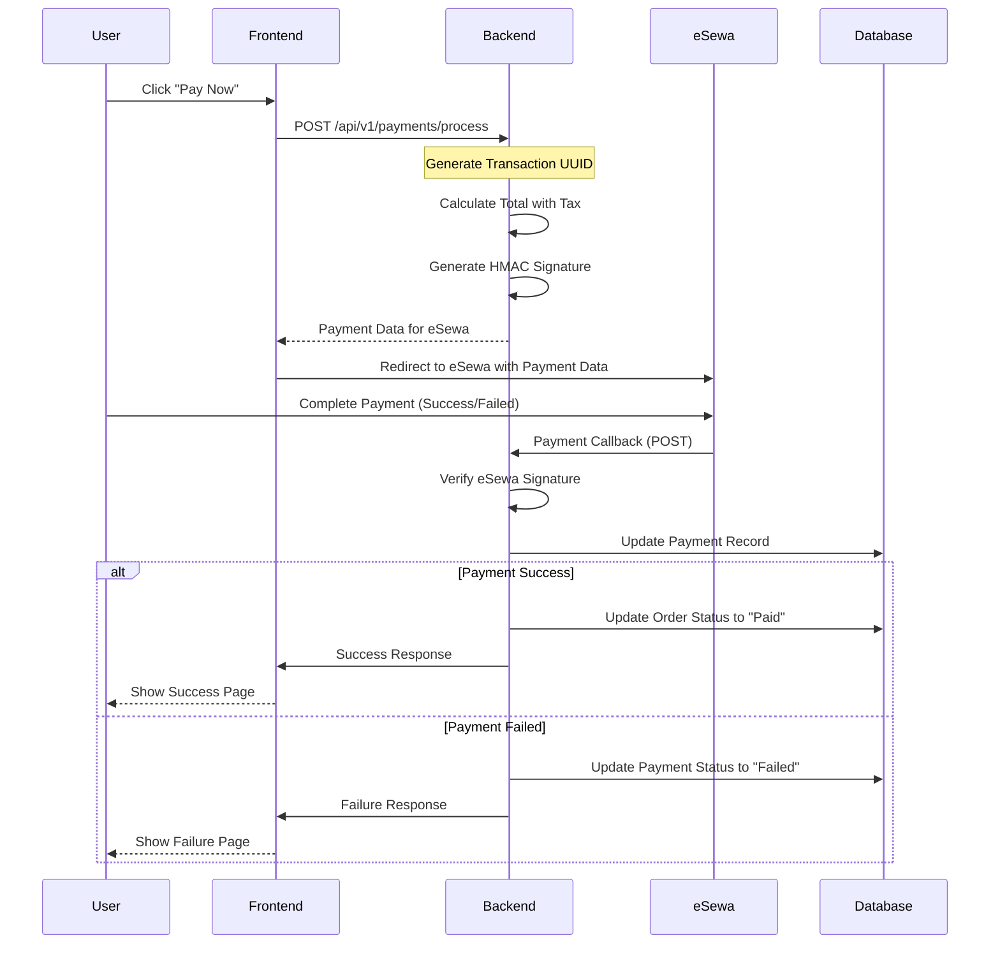
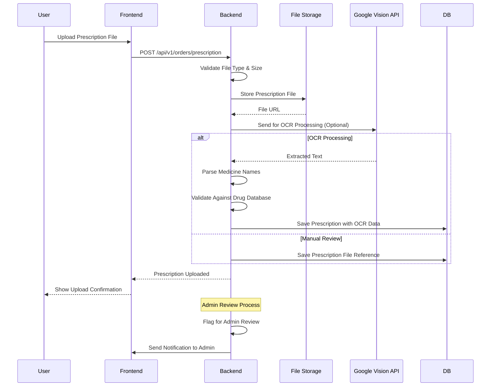
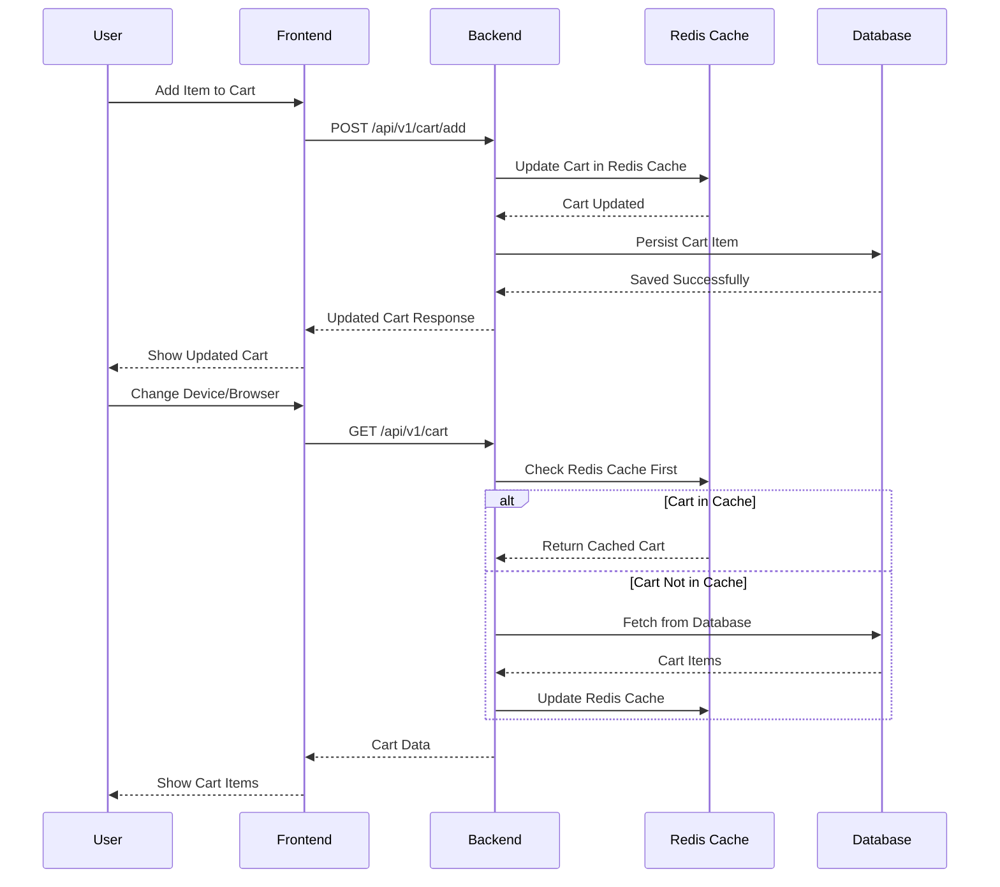
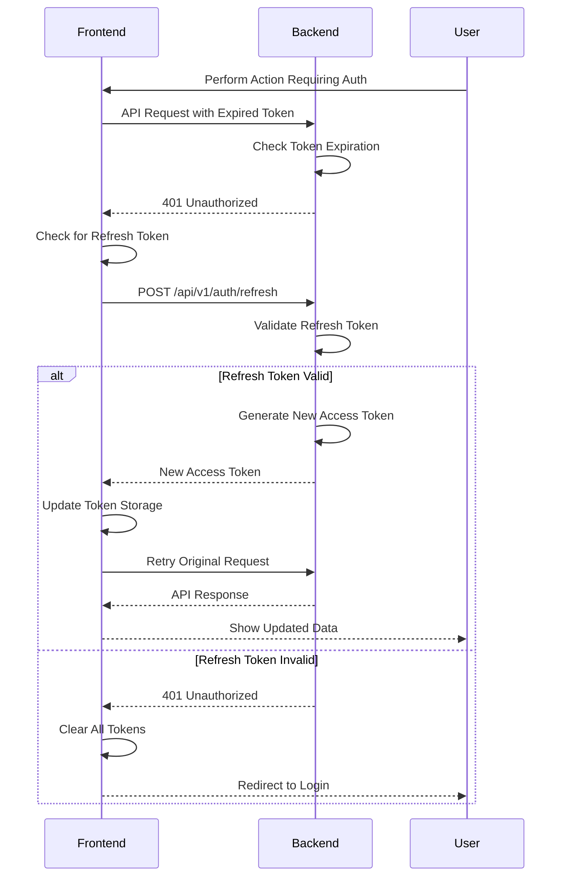
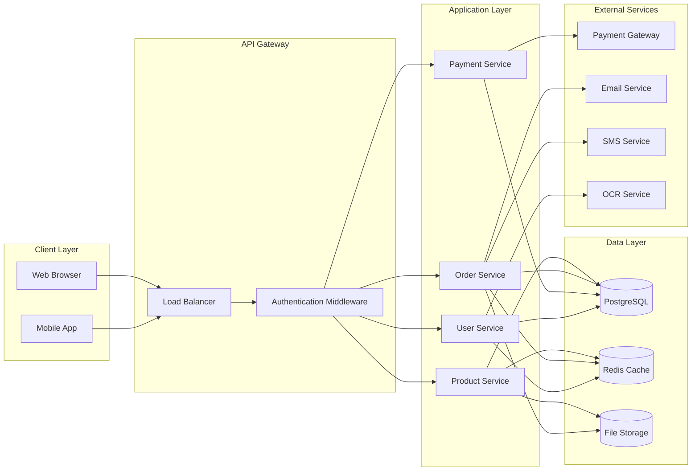
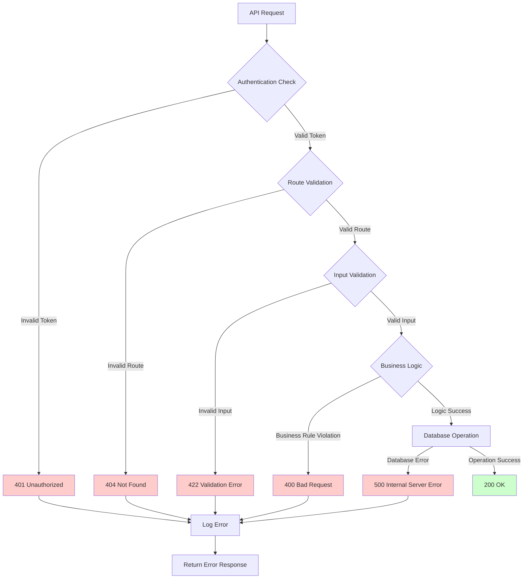
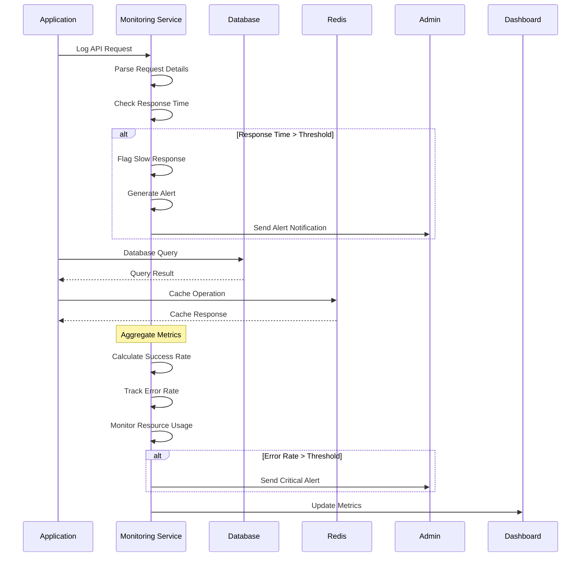

# MediNest System Flow Diagrams

## 🔄 User Registration Flow

## 🛒 E-commerce Order Flow

## 📋 Admin Product Management Flow

## 💳 Payment Processing Flow

## 📱 Prescription Upload Flow

## 🔄 Cart Synchronization Flow

## 🔐 Authentication Token Refresh Flow

## 📊 Data Flow Architecture

## 🚨 Error Handling Flow

## 📈 System Monitoring Flow

